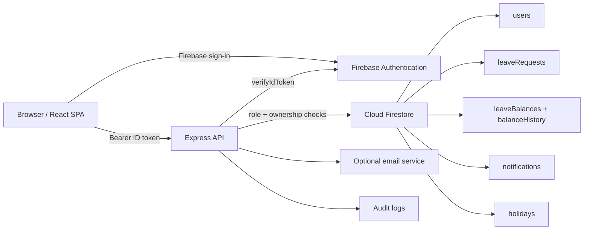
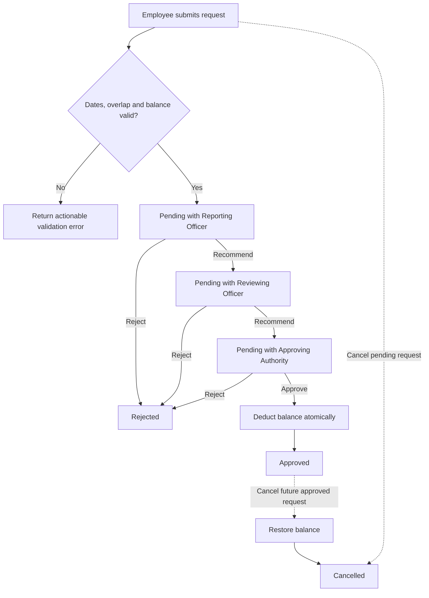
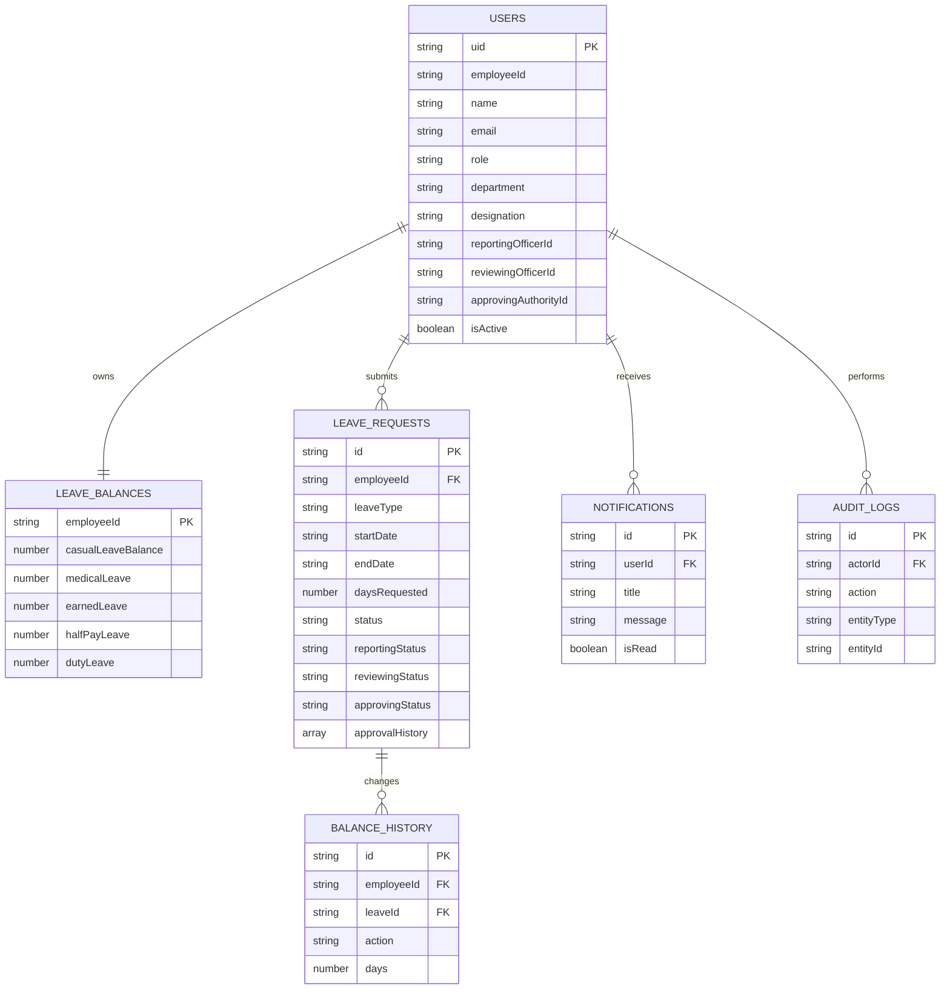

# System Architecture

## Component view

## Approval workflow

## Data model

## Security boundaries

The browser accesses Firestore only through the Express API. Firestore rules deny direct client reads and writes. Every protected API validates the Firebase ID token, checks the Firestore profile is active, and enforces roles plus request ownership/assignment. Firebase Admin credentials exist only on the backend.
